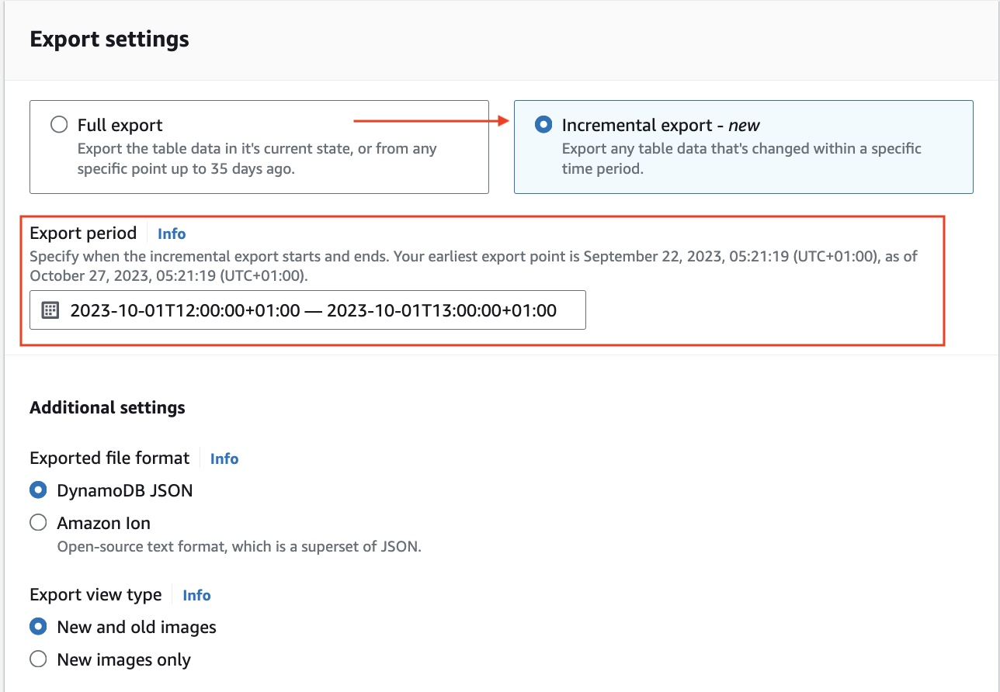

# Guidance for Incremental Data Exports on AWS

## Table of Content (required)

List the top-level sections of the README template, along with a hyperlink to the specific section.

### Required

1. [Overview](#overview)
    - [Cost](#cost)
2. [Prerequisites](#prerequisites)
    - [Operating System](#operating-system)
3. [Deployment Steps](#deployment-steps-required)
4. [Deployment Validation](#deployment-validation-required)
5. [Running the Guidance](#running-the-guidance)
6. [Next Steps](#next-steps-required)
7. [Cleanup](#cleanup-required)

## Overview

[DynamoDB](https://aws.amazon.com/dynamodb/) recently launched a new feature: [Incremental export to Amazon Simple Storage Service (Amazon S3)](https://aws.amazon.com/blogs/database/introducing-incremental-export-from-amazon-dynamodb-to-amazon-s3/). You can use incremental exports to update your downstream systems regularly using only the changed data. You no longer need to do a full export each time you need fresh data. The incremental export feature outputs only the data items that have been inserted, updated, or deleted between two specified points in time. The file format for incremental exports is different from full exports because it acts as an overlay (like a patch in source code) and includes metadata such as the time of each item’s last update as well as the old and new images of the item. Tooling that can read the full export format will not natively be able to read the combination of a full export plus the series of incremental exports without effectively applying the overlay first.

In this post, you learn how to bulk process a series of full and incremental exports using Amazon EMR Serverless with Apache Spark to produce a single Apache Iceberg table representing the latest state of the DynamoDB table, which you will then be able to query using Amazon Athena. Note that everything, from exporting to bulk processing to querying, is serverless.

In case you’re not familiar with these technologies:

- Amazon EMR Serverless makes it simple to run applications using open-source analytics frameworks like Apache Spark and Apache Hive without configuring, managing, or scaling clusters.
  
- Apache Spark is an interface for programming clusters with implicit data parallelism and fault tolerance.

- Apache Iceberg is a table format geared for large-scale datasets stored in S3 that has features like rapid query performance, atomic commits, and concurrent writing abilities. It also supports time-travel to query the data at points in the past. You can learn more on how Iceberg works.

- Amazon Athena is a serverless, interactive analytics service built on open-source frameworks, supporting open-table and file formats

The typical way to setup your analytics using DynamoDB exports is to first initiate a one-time full export to generate a new Iceberg table, and then repeatedly perform incremental exports (each incremental time period can be as small as 15 minutes or as large as 24 hours) to update the Iceberg table with all the changes. The data processing is done using Spark jobs running at scale on EMR serverless.

Note: You can optionally automate the pipeline and schedule regular updates using AWS EventBridge or Amazon Managed Workflows for Apache Airflow.

The following diagram shows the pipeline:


1. Application traffic updates DynamoDB. The new incremental export to S3 writes the changes in a raw format.
   
2. The EMR Serverless script integrates the changes into the Iceberg table as a processed layer.

3. Then downstream applications such as Athena can query the table as a single unit, enabling analysts or other consumers to analyze fresh DynamoDB data.

### Cost

You are responsible for the cost of the AWS services used while running this Guidance.

As of 04/15/2024, the cost for running this guidance with the default settings in the US East (N. Virginia) is approximately $48.27 per month for processing 1 million items.


| AWS service  | Dimensions | Monthly Cost [USD] |
| ----------- | ------------ | ------------ |
| Amazon DynamoDB | Average item size 0.5kb, 1 WCU per message  | $ 18.05 month |
| AWS S3 | 1 Million requests per month, Execution time of 20 milliseconds, 128 MB of memory allocated, Concurrency of 100  | $ 30.22 month |
| Total |  | $ 48.27 |
Amazon EMR Serverless | 1 Million requests per month, Execution time of 20 milliseconds, 128 MB of memory allocated, Concurrency of 100  | $ 30.22 month |
| Total |  | $ 48.27 |
Amazon Athena | 1 Million requests per month, Execution time of 20 milliseconds, 128 MB of memory allocated, Concurrency of 100  | $ 30.22 month |
| Total |  | $ 48.27 |
AWS Glue | 1 Million requests per month, Execution time of 20 milliseconds, 128 MB of memory allocated, Concurrency of 100  | $ 30.22 month |
| Total |  | $ 48.27 |

We recommend creating a [Budget](https://docs.aws.amazon.com/cost-management/latest/userguide/budgets-managing-costs.html) through [AWS Cost Explorer](https://aws.amazon.com/aws-cost-management/aws-cost-explorer/) to help manage costs. Prices are subject to change. For full details, refer to the pricing webpage for each AWS service used in this Guidance.

## Prerequisites

- The [AWS CLI](https://docs.aws.amazon.com/cli/latest/userguide/getting-started-install.html) installed.
- The visual editor of your choice, for example [Visual Studio Code](https://code.visualstudio.com/).

### Operating System

This solution supports build environments in Mac or Windows.

### AWS account requirements

This Guidance requires that you have access to the following AWS services:

- Amazon DynamoDB
- Amazon S3
- Amazon EMR Serverless
- Amazon Athena
- AWS Glue

## Deployment Steps (required)

Deployment steps must be numbered, comprehensive, and usable to customers at any level of AWS expertise. The steps must include the precise commands to run, and describe the action it performs.

* All steps must be numbered.
* If the step requires manual actions from the AWS console, include a screenshot if possible.
* The steps must start with the following command to clone the repo. ```git clone xxxxxxx```
* If applicable, provide instructions to create the Python virtual environment, and installing the packages using ```requirement.txt```.
* If applicable, provide instructions to capture the deployed resource ARN or ID using the CLI command (recommended), or console action.

 
**Example:**

1. Clone the repo using command ```git clone xxxxxxxxxx```
2. cd to the repo folder ```cd <repo-name>```
3. Install packages in requirements using command ```pip install requirement.txt```
4. Edit content of **file-name** and replace **s3-bucket** with the bucket name in your account.
5. Run this command to deploy the stack ```cdk deploy``` 
6. Capture the domain name created by running this CLI command ```aws apigateway ............```


## Deployment Validation  (required)

<Provide steps to validate a successful deployment, such as terminal output, verifying that the resource is created, status of the CloudFormation template, etc.>


**Examples:**

* Open CloudFormation console and verify the status of the template with the name starting with xxxxxx.
* If deployment is successful, you should see an active database instance with the name starting with <xxxxx> in        the RDS console.
*  Run the following CLI command to validate the deployment: ```aws cloudformation describe xxxxxxxxxxxxx```


## Running the Guidance

We will assume that you already have a DynamoDB table that you want to export for analytics. Exporting from a table doesn’t change the table or interfere with other traffic to the table. If you want to create a small sample table just for experimental purposes, you can refer to the getting started guide to setup your table.

These instructions use three S3 bucket locations.

1. An S3 folder for the full and incremental exports (“dynamodb-export-bucket”)
2. An S3 folder for the Spark scripts (“spark-script-bucket”)
3. An S3 folder for the Iceberg table (“iceberg-bucket”) as well as a generated schema definition file

You can use the same S3 bucket for all these with different prefixes, or you can use different buckets. We recommend you follow S3 security best practices when you setup S3 buckets.

**Step 1: Perform a full export from your DynamoDB table**

You’ll get things started with a full export of your DynamoDB table. This step is only done once.

To do a full export, navigate to the Exports to S3 section in your DynamoDB console and choose Export to S3.
Specify a DynamoDB table, an S3 bucket **(<dynamodb-export-bucket>)**, and an optional prefix. Select Full export and select Export from an earlier point in time.
Pick a nice round number time value from the recent past for simplicity. This will then be the starting time of your first incremental export. If you’re doing hourly exports, pick a recent top of the hour. In this example we will use **2023-10-01 12:00:00** in the local time zone. Select DynamoDB JSON as your output type, pick the encryption key, and choose Export.


For more details on how to do a full export, see AWS documentation on DynamoDB exports.

Once the full export completes, you will see the output in your S3 bucket.

**Step 2: Create an EMR Serverless application**

Next, configure an EMR Serverless application that will act as the execution environment for all your bulk activities. EMR Serverless is ideal for these jobs because it runs for a short duration and then has a long delay before the next invocation. EMR Serverless automatically determines the resources that the application needs, allocates these resources to process your jobs, and releases the resources when the jobs finish. Hence, you do not incur any additional costs when your jobs are not running.

From your AWS Console, make sure you’re in the same AWS Region as where your three buckets are located. Then search for Amazon EMR to open the EMR console. On the left sidebar choose EMR Serverless.


1. Select Get started (or if this isn’t your first time using EMR Studio, select Manage applications).

2. Now you can create an EMR Serverless application. Choose type Spark and the latest version of EMR from drop down as shown:


There are other optional configurations you can adjust, but the defaults will work for this walkthrough. If you prefer the AWS command-line interface (CLI), the following command creates a similar cluster:

```
aws emr-serverless create-application --name "ddb-incremental-exports" --type SPARK --release-label emr-6.14.0
```

If you’re using the CLI, note the EMR serverless application ID that is returned. It is required in later steps. You can also retrieve the EMR serverless application ID from the AWS EMR console where you can see your newly created EMR serverless application.

**Step 3: Prepare an EMR Serverless execution role**

The EMR Serverless job execution requires an IAM role that has sufficient permissions to read from the ```<dynamodb-export-bucket>``` and ```<spark-script-bucket>```, read and write the ```<iceberg-bucket>```, and access the [AWS Glue Catalog](https://docs.aws.amazon.com/glue/latest/dg/catalog-and-crawler.html).

You can download a [sample set of AWS CLI commands](https://github.com/aws-solutions-library-samples/guidance-for-incremental-data-exports-on-aws/blob/main/code/emr_serverless_executionrole_sample.cli) then **replace the bucket placeholder names with your actual bucket names inside the script**. After replacing the bucket names, you can run the set of CLI commands to create an IAM role in your AWS account with the right permissions.

**Step 4: Use EMR Serverless to read the full export and dynamically identify the table schema**

DynamoDB doesn’t enforce a schema and different items can have different attributes. Iceberg tables, however, have a fixed schema. The best way to ensure that your unstructured DynamoDB data correctly maps to your structured Iceberg table is to create an Iceberg table with the full set of columns that will map to all the unique attributes from your full DynamoDB dataset.

You can also define the schema manually but it might be easier to run a Spark job that analyzes your DynamoDB full export and outputs the schema with all the attributes.

The script to infer the schema is available at [detect_schema_from_full_export.py](https://github.com/aws-solutions-library-samples/guidance-for-incremental-data-exports-on-aws/blob/main/code/detect_schema_from_full_export.py). It writes the generated schema in JSON format. Save the script and upload it to ```s3://<spark-script-bucket>/<optional-prefix>/.``` The IAM role above should give your EMR Serverless application read access to this bucket.

You will now submit a job to infer your schema using the full export. The job will be submitted to the EMR Serverless application you created in the previous step.

1. Go to the **Submit job** in you EMR application.

2. Enter a name of your job. In this case, we will name it “detect_schema_from_full_export”.
   
3. For the **Runtime role**, use the ARN for the role you created in Step 3 (selectable from drop down).

4. For the **Script location**, enter the S3 path where you saved the Python script (you can use the UI to find it).

5. For the **Script arguments**, provide the S3 location of the DynamoDB full export (from step 1) and the output file path where the schema file will be written. Note that job role running your EMR serverless application needs write permissions to the schema output location. You can use the ```<iceberg-bucket>``` since you already have the job role setup for write permissions on that bucket. Here is starter text to copy-paste for the arguments:
```
[
 "s3://<dynamodb-export-bucket>/<optional-prefix>/<full-export-folder>/",
 "s3://<iceberg-bucket>/<optional-prefix>/schema.json"
]
```
Real example to demonstrate the script arguments:
```
[
 "s3://mybucket/exports/AWSDynamoDB/01697091611852-ae49471c/",
 "s3://myiceberg/schema/schema.json"
]
```
Ensure that all three buckets are co-located in the same Region as the EMR Serverless application job. If they are not in the same region, the job will fail with a ```ConnectTimeoutException``` during execution.


Alternatively, you can use the following AWS CLI submit for your job to the EMR Serverless application.

```
aws emr-serverless start-job-run \
  --application-id application-id \
  --execution-role-arn job-role-arn \
  --job-driver '{"sparkSubmit": {"entryPoint": "s3://<spark-script-bucket>/<optional-prefix>/detect_schema_from_full_export.py", "entryPointArguments": ["s3://<dynamodb-export-bucket>/<optional-prefix>/<full-export-folder>/", "s3://<iceberg-bucket>/<optional-prefix>/schema.json"]}}'
```
The job will take a few minutes to run, depending on the size of your DynamoDB full export. You can track the job progress in the EMR Serverless job console. If it says Success, the job has completed. Otherwise, review the console error or driver logs (stdout/stderr) and correct any errors such as a mistyped parameter.


Upon success, you’ll have a schema.json file at the location specified in the arguments which contains the schema from your DynamoDB full export. It should look something like this:
```
# Sample schema
# Key is column name, value is a data type 
{
    "product_id": "S",
    "quantity": "N",
    "remaining_count": "N",
    "inventory_date": "S",
    "price": "S",
    "product_name": "S"
}
```

**Step 5: Create an AWS Glue Data Catalog database**

We suggest you use AWS Glue Data Catalog to persist the Iceberg table meta store so you can query the tables from Athena (or any Hive Meta store compatible query engine) using the same Glue Catalog. The scripts from this post assume ```dev``` as the default catalog name and ```db``` as the default database name. Create the ```db``` database in your Glue Data Catalog using following AWS CLI command:

```
aws glue create-database --database-input '{"Name":"db"}'
```

**Step 6: Use EMR Serverless to build the Iceberg table based on the full export and using the generated schema**

Download the [create_iceberg_from_full_export.py](https://github.com/aws-solutions-library-samples/guidance-for-incremental-data-exports-on-aws/blob/main/code/create_iceberg_from_full_export.py) script and store it in your ```<spark-script-bucket>``` to load the full export into an Iceberg table. The pyspark script does these main actions:

1. **Reads the JSON data into a DataFrame**
A DataFrame is a data structure that organizes data into a 2-dimensional table of rows and columns. DataFrames are one of the most common data structures used in modern data analytics because they are a flexible and intuitive way of storing and working with data. The first data frame here matches the JSON format in the S3 bucket.

2. **Applies the schema to make a new DataFrame**
The script then uses the schema to transform the JSON-based DataFrame to one that matches the provided schema.

3. **Writes the new DataFrame to the target Iceberg table**
The script then bulk writes the DataFrame to a new Iceberg table.

Submit the job using the console to the EMR Serverless application as shown in the screenshot below. Provide a name for the job, the job role, the location of your python script ```(<spark-script-bucket>)```, and script arguments.


Here is starter text to copy-paste for the script arguments:
```
[
 "s3://<dynamodb-export-bucket>/<optional-prefix>/<full-export-folder>/",
 "s3://<iceberg-bucket>/<optional-prefix>/schema.json",
 "<iceberg-table-name>",
 "s3://<iceberg-bucket>/<optional-prefix>/"
]
````
Real example to demonstrate the script arguments:
```
[
 "s3://mybucket/exports/AWSDynamoDB/01697091611852-ae49471c/",
 "s3://myiceberg/schema/schema.json",
 "iceberg",
 "s3://myiceberg/ice-chest/"
]
```
Alternatively, you can use the AWS CLI to submit your job to the EMR Serverless application.
```
aws emr-serverless start-job-run \
  --application-id application-id \
  --execution-role-arn job-role-arn \
  --job-driver '{"sparkSubmit": {"entryPoint": "s3://<spark-script-bucket>/<optional-prefix>/create_iceberg_from_full_export.py","entryPointArguments": ["s3://<dynamodb-export-bucket>/<optional-prefix>/<full-export-folder>/","s3://<iceberg-bucket>/<optional-prefix>/schema.json","<iceberg-table-name>","s3://<iceberg-bucket>/<optional-prefix>"]}}'
```
The script will take a few minutes to run. You can track the progress in the AWS console.

**Step 7: Use Athena to confirm the new Iceberg table is readable**

Next, you can use Athena to confirm the new Iceberg table was created correctly. In the AWS console, open the Athena service and open the Query editor on the left sidebar.

1. Before you run your first query, you must set up a query result location in S3.

2. Go to the Settings tab and point to a prefix of your choosing under the ```<iceberg-bucket>```.

3. For a query, choose ```“select * from <iceberg-table-name> limit 10” ``` where your table name matches that given in Step 6.

The following screenshot shows a simple select with the first 10 items from the Iceberg table. You can also try ```“select count(*) from <iceberg-table-name>”``` to see how many items are presently in the Iceberg table.


Note that the table is automatically visible from the Athena console because the previous script created the Iceberg table using Glue Data Catalog.

**Step 8: Perform an incremental export from your DynamoDB table**

To run an incremental export, use the AWS console for DynamoDB and navigate to the **Exports to S3**. Select the same table, and provide the target S3 bucket and prefix. These can be the same as your full export, but don’t have to be. Select **Incremental Export**. The start time should be the time used in Step 1. The end time can be an hour later. With exports the start time is always inclusive and the end time is always exclusive, so by using the exact same timestamp when stitching exports together it ensures no missing or duplicate data. Select **DynamoDB JSON** as your export type, choose either **New and old images or New images only** (the Spark script only requires the new images), pick your encryption key, and start the export.



**Step 9: Update the Iceberg table with the incremental export**

While waiting for the incremental export job to complete, you can copy the script [update_iceberg_from_incremental_export.py](https://github.com/aws-solutions-library-samples/guidance-for-incremental-data-exports-on-aws/blob/main/code/update_iceberg_from_incremental_export.py) and save it in ```<spark-script-bucket>```.

The script works similarly to the script for full exports, except in the final step it will [MERGE[(https://iceberg.apache.org/docs/latest/spark-writes/#merge-into) the incremental export’s DataFrame into the existing Iceberg table. To merge this incremental data into the target Iceberg table, the script dynamically creates join conditions based on the item keys. These conditions will determine how the incremental data matches with existing records in the target table. The MERGE INTO command allows for the combination of the target and source tables based on the join conditions.

The merge logic is as follows:

1. If a record in the target table matches a record in the incremental data, and the incremental data value is null for the key, the record in the target table is deleted.

2. If a record in the target table matches a record in the incremental data, the record in the target table is updated.

3. If there’s no match for a record from the incremental data in the target table, the record is inserted into the target table.

4. The constructed merge query is then executed using SparkSQL, resulting in the target table being updated with the latest incremental changes.

To submit the incremental update job, go to the EMR console and choose Submit job to your EMR Serverless application. This step is similar to step 5. Just note the different script name and the need to point at the incremental export folder this time.
This section should include:


Here is starter text to copy-paste for the arguments:
```
[
 "s3://<dynamodb-export-bucket>/<optional-prefix>/<incremental-export-folder>/",
 "s3://<iceberg-bucket>/<optional-prefix>/schema.json",
 "<iceberg-table-name>",
 "s3://<iceberg-bucket>/<optional-prefix>/"
]
```
Real example to demonstrate the script arguments (note the new incremental path):
```
[
 "s3://mybucket/exports/AWSDynamoDB/01697092259000-286db8d3/",
 "s3://myiceberg/schema/schema.json",
 "iceberg",
 "s3://myiceberg/ice-chest/"
]
```
Alternatively, you can use the AWS CLI to submit your job to the EMR Serverless application.
```
aws emr-serverless start-job-run \
  --application-id application-id \
  --execution-role-arn job-role-arn \
  --job-driver '{"sparkSubmit": {"entryPoint": "s3://<spark-script-bucket>/<optional-prefix>/update_iceberg_from_incremental_export.py","entryPointArguments": ["s3://<dynamodb-export-bucket>/<optional-prefix>/<incremental-export-folder>","s3://<iceberg-bucket>/<optional-prefix>/schema.json","<iceberg-table-name>","s3://<iceberg-bucket>/<optional-prefix>"]}}'
```
When the script completes, the Iceberg tables will have been updated with the incremental export. Table changes are atomic, and readers never see partial or uncommitted changes.

To run this work on a schedule, you can repeat Step 8 and Step 9. For Step 8, adjusting the export period to meet your requirements of how often you want to update your data lake. For Step 9, make sure to substitute the new incremental export folder with the new export ID. 

Note: Consider [compacting your Iceberg tables periodically](https://iceberg.apache.org/docs/1.2.0/maintenance/) as well to reduce the accumulated metadata overhead and improve query speed.

**Step 10: Use Athena to confirm the update**

You can confirm the update by running the same Athena queries as before, now with different results. For example, if you’ve added or removed items, the count should reflect this.

The following screenshot shows a simple select with updated values (quantity for product_id 18 was updated to 100) due to incremental updates on your full table. If you were using your own data, the schema would be different.


Some Iceberg features to be aware of:

1. [Schema evolution](https://docs.aws.amazon.com/athena/latest/ug/querying-iceberg-evolving-table-schema.html) – the ability to change the table schema if the DynamoDB table schema were to change. Just remember to update the JSON schema file to pick up changes for your incremental exports and alter iceberg table.

2. [Time travel](https://docs.aws.amazon.com/athena/latest/ug/querying-iceberg-table-data.html) – the ability to query at a past time regardless of the current state of the data

## Next Steps (required)

Provide suggestions and recommendations about how customers can modify the parameters and the components of the Guidance to further enhance it according to their requirements.

## Cleanup (required)

If you created any demo [DynamoDB](https://docs.aws.amazon.com/amazondynamodb/latest/developerguide/WorkingWithTables.Basics.html#WorkingWithTables.Basics.DeleteTable) tables, you can [delete those tables](https://docs.aws.amazon.com/emr/latest/EMR-Serverless-UserGuide/studio.html#studio-manage-app) to clean up. It’s good form to stop and delete your EMR Serverless application as part of the clean-up, but you would only be charged if you are running jobs under the application. Lastly, you may wish to [delete any S3 objects](https://docs.aws.amazon.com/AmazonS3/latest/userguide/DeletingObjects.html) to avoid unwanted charges to your AWS account.
